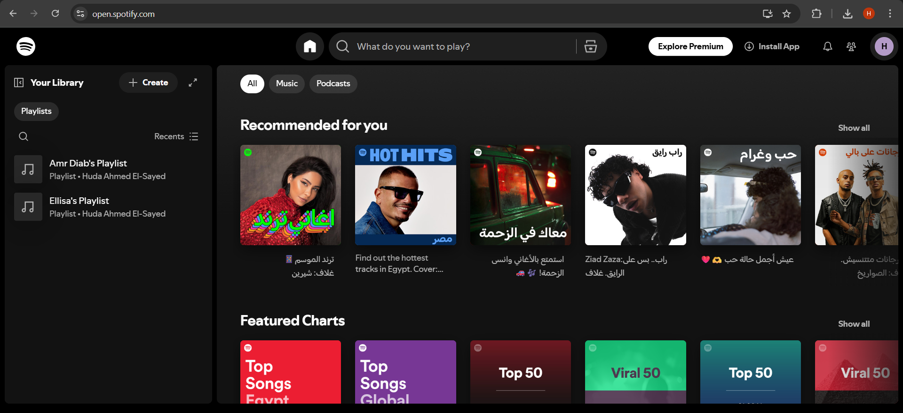

# 🎵 Spotify API Testing with Postman

This project demonstrates **API testing** of the Spotify Web API using **Postman**.  
The goal is to practice REST API testing concepts, OAuth 2.0 authentication, and CRUD operations (Create, Read, Update) on Spotify playlists.  

---

## 📌 Features Tested
- **OAuth 2.0 Authorization Flow**
  - Request access token
  - Refresh token  
- **Spotify API Endpoints**
  | Method   | Endpoint                     | Description                   |
  | -------- | ---------------------------- | ----------------------------- |
  | **GET**  | `/me`                        | Retrieve current user profile |
  | **POST** | `/users/{user_id}/playlists` | Create a playlist             |
  | **GET**  | `/playlists/{playlist_id}`   | Fetch playlist details        |
  | **PUT**  | `/playlists/{playlist_id}`   | Update playlist details       |

- **Assertions**
  - Status code checks (200, 201)
  - JSON schema validation
  - Response body validation

---

## 🛠️ Tools & Technologies
| Tool/Tech         | Purpose                              |
|-------------------|--------------------------------------|
| **Postman**       | API testing & automation             |
| **Spotify Web API** | Target API for CRUD testing         |
| **OAuth 2.0**     | Authentication and token handling    |
| **JSON**          | Request/response data format         |
| **GitHub**        | Version control & project hosting    |

---

## 📂 Project Structure
spotify-api-testing/
│
├── collections/ # Postman collection file
├── environments/ # Postman environment file
├── screenshots/ # Screenshots of requests/responses
└── README.md # Project documentation

---

## 📸 Screenshots

|  Spotify Dashboard                |                              |

---

## 🚀 How to Use
1. **Clone the repository**
   ```bash
   git clone https://github.com/yourusername/spotify-api-testing.git
   cd spotify-api-testing
   
2. **Import into Postman**
   - Open Postman
   - Import collections/spotify_api_testing_collection.json
   - Import environments/spotify_environment.json

3. **Configure Environment Variables**
   - Set client_id, client_secret, redirect_uri, and refresh_token.

4. **Run Requests**
   - Execute requests in sequence to:
        - Authenticate
        - Create a playlist
        - Retrieve playlist details
        - Edit playlist
        - Refresh token

--- 

## 🧾 Learning Outcomes
- Mastered Postman for API testing
- Understood OAuth 2.0 Authorization Code Flow
- Performed CRUD API testing
- Implemented assertions for validation
- Learned structured API test documentation
